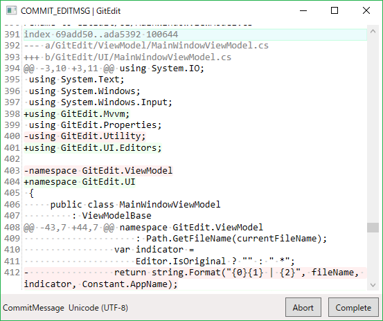

# GitEdit
Simple text editor for Git.



## Features
- Quick launch.
- Syntax highlighting:
    - `COMMIT_EDITMSG` with diff (See ``git commit -v``),
    - `.gitignore`, etc.
- Input completion:
    - ``Ctrl+Space`` to try complete.
- Optimized commands for Git:
    - ``Ctrl+W`` to save and exit.
    - ``Ctrl+Shift+Delete`` to clear all, save and exit. (To cancel commit, rebase, etc.)

## Install
Download [the latest binary](https://github.com/vain0/GitEdit/releases/latest).

Set GitEdit as your editor for git:

```
# To use GitEdit for current repository.
git config --local core.editor "the-unarchived-directory/GitEdit.exe"

# To use GitEdit for all repositories.
git config --global core.editor "the-unarchived-directory/GitEdit.exe"
```

## Bulid
Before build, you need to install dependency packages via Paket:

```
.paket/paket.bootstrapper.exe
.paket/paket.exe install
```

To build, use Visual Studio 2015 (or later) or MSBuild.
